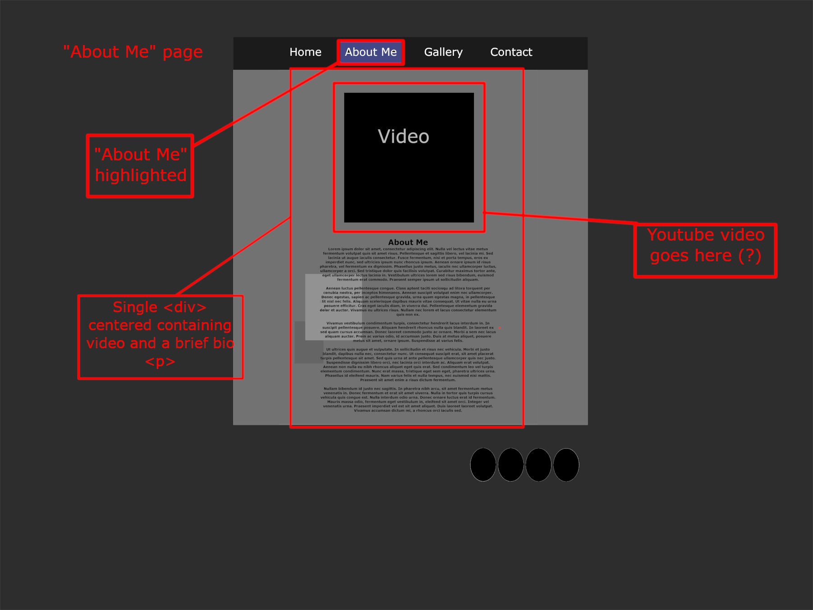
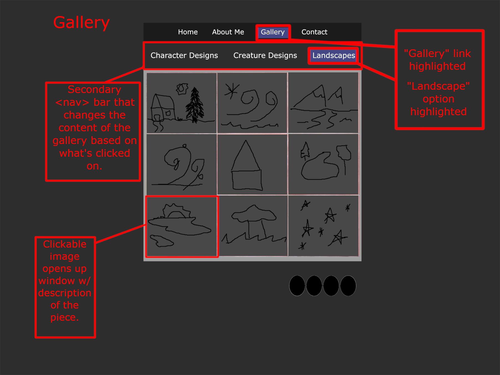
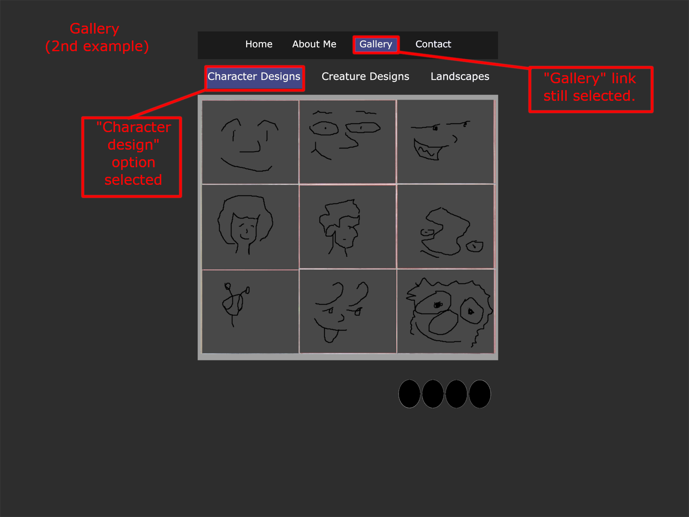
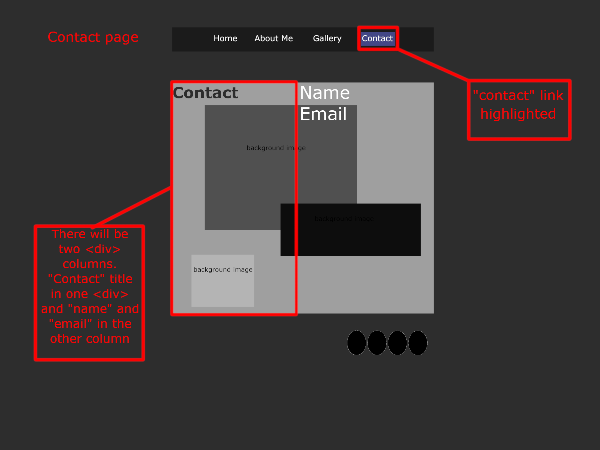

# Demetrius Horton Project

## Description

# An art gallery of my character and creature designs and landscape sketches. It will contain a landing page, a bio, a three-page art gallery showcasing my creature, character, and landscape artwork and a contact page.

## Wireframes

# I have included several wireframes that showcase the layout and structure of each page on my site as the links in the navbar are highlighted. I forgot to include a header, so the final version will include that.

### Home

Header - Forgot header(?)

Navigation Menu - will contain a label with a link to each of the four pages - 'Home', 'About Me', 'Gallery', and 'Contact

Main Content - will contain a basic artsy CSS background with my name and title.

Footer - links to social media and copyright (not shown in image.)

### About Me

Header - Forgot header(?)

Navigation Menu - will contain a label with a link to each of the four pages - 'Home', 'About Me', 'Gallery', and 'Contact

Main Content - will contain Youtube video and basic bio underneath.

Footer - links to social media and copyright (not shown in image.)

### Gallery

Header - Forgot header(?)

Navigation Menu - will contain a label with a link to each of the four pages - 'Home', 'About Me', 'Gallery', and 'Contact

Navigation Menu 2 - will contain a secondary nav containing buttons that opens up three different galleries for 'character', 'creature', and 'landscapes'.

Main Content - a grid of images that opens up window for artwork with a description of image (forgot to include image of that)

Footer - links to social media and copyright (not shown in image.)

### Contact Page

Header - Forgot header(?)

Navigation Menu - will contain a label with a link to each of the four pages - 'Home', 'About Me', 'Gallery', and 'Contact

Main Content - will contain two divs (columns) -- 'Contact Me' title in one column, my name, email, and more links to social media (not shown, but it will resemble the ones in the footer).

Footer - links to social media and copyright (not shown in image.)
